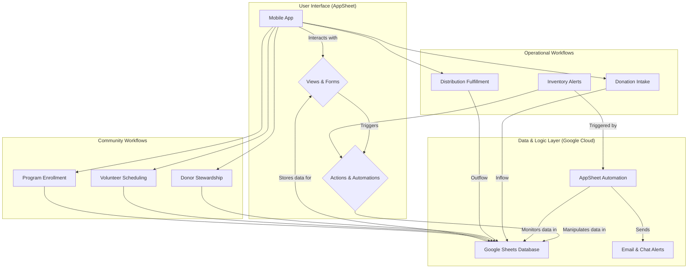

# 🥕 Gwangmyeong Food Bank AppSheet Project

Helping Gwangmyeong Food Bank digitize its operations with a no-code, mobile-first AppSheet app backed by Google Sheets.

---

## Start Here (15-minute Quick Setup)

Absolute beginner? Follow these steps in order. Every file you need already lives in this repository.

1. **Copy the sample data:** Upload each CSV in `database/` into its own worksheet inside a new Google Sheet named `Gwangmyeong Food Bank DB`. Start with the core tables (`Inventories`, `Items`, `Stock`, `Clients`, `Distribution_Events`, `Distribution_Items`, `Donations`, `Donation_Items`, `Donors`) and add the optional community modules (`Volunteers`, `Volunteer_Shifts`, `Programs`, `Client_Programs`) when you are ready.
2. **Let AppSheet build the scaffold:** Visit [AppSheet](https://www.appsheet.com) -> `Create` -> `App` -> `Start with existing data`, select the Google Sheet you just prepared, and let the default app generate.
3. **Run the in-editor checklist:** Use the AppSheet "To Do" panel to confirm key columns, label columns, and references. Match the guidance in `ProjectPrompt.md`.
4. **Add your first automations:** Follow the "Automations" section in `ProjectPrompt.md` to enable the Low Stock email bot and the donation intake workflow that converts incoming donation items into stock.
5. **Share & test:** Invite a teammate by email from the AppSheet "Users" tab so they can try the mobile app and give feedback.

> **Need more hand-holding?** Open `AppSheet_Full_Guide.ko.md` for a fully narrated, screenshot-friendly walkthrough in Korean.

---

## Guided Learning Path

- **Phase 1 - Foundation (30-45 min):** Complete the Quick Setup above, then explore the `Stock` and `Clients` views on your phone to confirm relationships between tables.
- **Phase 2 - Personalize (45-60 min):** Follow the "Views and UX" section in `ProjectPrompt.md` to style dashboards and surface donor and distribution pipelines with grouped deck views.
- **Phase 3 - Automate (60+ min):** Build the inflow/outflow `Actions`, donation-to-stock automation, and low-stock alerts. Submit test donations and distributions to validate each workflow.
- **Phase 4 - Community modules (optional, 45+ min):** Turn on volunteer scheduling and client program tracking once the core flows feel solid.

Keep this progression visible during workshops so participants always know what is next.

---

## Bring Generative AI Into the Build

- **Describe-your-app start:** On the AppSheet start screen, choose **"Create an app from an idea"** (Labs). Paste a short prompt such as:
    > "Create a food bank inventory tracker that manages donations, clients, and low-stock alerts."
  Compare the generated schema with the one in this repo and merge anything useful.
- **Use AppSheet Assistant:** Inside the editor, tap the Assistant (sparkle icon) and ask questions like "How do I decrement stock when a distribution is saved?" The Assistant will suggest expressions and automation steps you can copy.
- **Prototype community modules:** Ask for help building volunteer shift reminders or client program enrollment views, then adapt the suggested expressions to the new tables.
- **Document prompts:** Save the prompts you use into a new section of your Google Sheet so newcomers can reuse winning prompts in future cohorts.

---

## Architecture Overview (For Reference)

The solution stays intentionally lightweight so non-technical staff can support it.

### Architectural Notes

- **Data Source (Google Sheets):** One workbook now houses inventory, service, donor, volunteer, and program tables so staff can audit everything in a single place.
- **AppSheet Layer:** Handles the UI, validation, and automations without code, relying on references between event and line-item tables.
- **Inventory & Service Logic:** `Stock` tracks reorder metadata while `Distribution_Events`/`Distribution_Items` and `Donations`/`Donation_Items` isolate detailed transactions.
- **Community Modules:** `Donors`, `Volunteers`, and `Client_Programs` introduce stewardship, scheduling, and impact reporting without extra tooling.
- **Automations:** Scheduled bots cover low-stock alerts, expiry checks, donation intake, and volunteer reminders.

---

## Database Schema Cheat Sheet

### Core Operations

| Table Name | Role | Key Column | Highlights |
| :--- | :--- | :--- | :--- |
| `Inventories` | Physical storage locations with capacity and contacts | `Inventory_ID` | Manager info, capacity, temperature control |
| `Items` | Master catalog of items | `Item_ID` | Unit size, storage type, dietary tags, reorder point |
| `Stock` | Inventory snapshot linking items to locations | `Stock_ID` | Reorder thresholds, last count metadata, storage bins |
| `Clients` | Household records receiving services | `Client_ID` | Language, household size, eligibility status |
| `Distribution_Events` | Header record for each pickup or delivery | `Distribution_ID` | Pickup method, staff lead, signature capture |
| `Distribution_Items` | Line items tied to each distribution | `Distribution_Item_ID` | Links to stock and records quantities distributed |
| `Donations` | Donation intake events | `Donation_ID` | Delivery method, paperwork status, receiving staff |
| `Donation_Items` | Items received per donation | `Donation_Item_ID` | Routes items to inventories on arrival |
| `Donors` | Donor profiles and preferences | `Donor_ID` | Contact methods, donor type, notes |

### Community & Programs

| Table Name | Role | Key Column | Highlights |
| :--- | :--- | :--- | :--- |
| `Volunteers` | Volunteer directory | `Volunteer_ID` | Preferred roles, availability, training status |
| `Volunteer_Shifts` | Scheduled volunteer assignments | `Shift_ID` | Dates, roles, and shift status |
| `Programs` | Service programs offered to clients | `Program_ID` | Target groups and active flag |
| `Client_Programs` | Enrollment of clients into programs | `Client_Program_ID` | Enrollment status and notes |

> Looking for sample data? Each CSV in `database/` ships with ready-to-import demo rows for workshops and testing.

---

## Supporting Documents

- `AppSheet_Full_Guide.ko.md`: Conversational Korean walkthrough aimed at complete beginners.
- `ProjectPrompt.md`: Operator checklist for configuring views, actions, automations, and community modules.
- `README.ko.md`: Korean version of this overview for bilingual teams.

Use these documents together to support mixed-language teams and first-time builders.

