# 🥕 Gwangmyeong Food Bank AppSheet Project

---

## 📝 Project Overview
This project aims to build a mobile-first AppSheet application to support the core operations of the Gwangmyeong Food Bank, including **inventory management, distribution tracking, and client management**, using Google Sheets as the database. This application will streamline workflows, automate critical notifications, and provide a centralized platform for managing food bank activities.

---

## 🏛️ Architecture and Structure
The architecture is designed for simplicity, scalability, and low-maintenance overhead, leveraging the powerful integration between Google Sheets and AppSheet.

### Architectural Diagram (Mermaid)

```mermaid
graph TD
    subgraph "User Interface (AppSheet)"
        A[📱 Mobile App]
        A -- Interacts with --> B{Views & Forms};
        B -- Triggers --> C{Actions & Automations};
    end

    subgraph "Data & Logic Layer (Google Cloud)"
        D[📊 Google Sheets Database]
        D -- Stores data for --> B;
        C -- Manipulates data in --> D;
        E[🔄 AppSheet Automation]
        E -- Monitors data in --> D;
        E -- Sends --> F[📧 Email Notifications];
    end

    subgraph "Key Workflows"
        direction LR
        G[Donation] -- Inflow --> D;
        H[Distribution] -- Outflow --> D;
        I[Low Stock Alert] -- Triggered by --> E;
        J[Expiry Warning] -- Triggered by --> E;
    end

    A --> G;
    A --> H;
```

### Architectural Explanation
*   **Data Source (Google Sheets):** A single Google Sheet acts as the backend database, containing four interconnected tables (worksheets). This approach is cost-effective and easy for non-developers to view and manage directly if needed.
*   **Application Layer (AppSheet):** The AppSheet platform reads the Google Sheet and generates a feature-rich mobile application. It handles the UI, data manipulation logic (Actions), and business rules.
*   **User Interface (Views & Forms):** The app provides intuitive views (Dashboard, Deck, Table) for displaying data and user-friendly forms for data entry (e.g., new distribution, new donation).
*   **Business Logic (Actions & Automations):**
    *   **Actions:** Triggered by user interactions (like saving a form), these actions update the inventory in real-time. For example, when a distribution is recorded, the stock level of the distributed item is automatically decremented.
    *   **Automations:** These are scheduled server-side processes that run independently. The system automatically checks for low-stock items and expiring products daily, sending email alerts to the responsible staff. This proactive approach minimizes waste and prevents stock shortages.

---

## 🚀 How to Use & Setup
1.  **Prepare Google Sheet:** Create a new Google Sheet named `Gwangmyeong Food Bank DB`.
2.  **Create Worksheets:** Inside the sheet, create four worksheets with the exact names: `Inventory`, `Clients`, `Distribution_Log`, `Donation_Log`.
3.  **Define Columns:** In the first row of each worksheet, enter the column headers as defined in the database schema section. The order and exact naming are critical.
4.  **Connect to AppSheet:**
    *   Go to [AppSheet](https://www.appsheet.com) and start a new app.
    *   Connect it to your Google account and choose the `Gwangmyeong Food Bank DB` sheet as the data source.
    *   AppSheet will automatically detect the tables.
5.  **Configure App:** Follow the specifications in `ProjectPrompt.md` to configure views, actions, and automations.

---

## 🔗 Database Schema (Table Definitions)
The database is normalized to prevent data redundancy and improve scalability. The inventory is managed across three related tables:

| Table Name | Role | Key Column | Other Important Columns |
| :--- | :--- | :--- | :--- |
| `Inventories` | Stores physical warehouse/pantry locations | `Inventory_ID` | `Inventory_Name`, `Address` |
| `Items` | Master list of all unique items | `Item_ID` | `Item_Name`, `Category_Large`, `Category_Medium`, `Category_Small` |
| `Stock` | Links Items to Inventories, tracking quantity | `Stock_ID` | `Inventory_ID` (Ref), `Item_ID` (Ref), `Quantity`, `Expiry_Date` |
| `Clients` | Client profiles and special needs | `Client_ID` | `Name`, `Address`, `Allergies_Dietary_Restrictions` |
| `Distribution_Log` | Records of item distribution and proof | `Log_ID` | `Distribution_Date`, `Client_ID` (Ref), `Recipient_Signature` |
| `Donation_Log` | Records of item donations and sponsors | `Donation_ID` | `Donor_Name`, `Donation_Date`, `Item_ID` (Ref), `Quantity` |

**Table Descriptions:**
*   **Inventories:** A simple list of all physical locations (e.g., "Gwangmyeong City Hall Pantry", "Soha-dong Warehouse") where items are stored.
*   **Items:** The master catalog of every unique item the food bank handles (e.g., "Rice 10kg", "Ramen 5-pack"). This prevents duplicate item names and makes management easier.
*   **Stock:** The core inventory tracking table. It answers the question: "How many of *which item* are at *which inventory location*?" It links the `Inventories` and `Items` tables.
*   **Clients:** Manages information about the individuals receiving support.
*   **Distribution_Log:** A log of all distribution activities. It should be modified to link to a `Stock_ID` to decrement the correct stock.
*   **Donation_Log:** Tracks all incoming donations. It now links to an `Item_ID` to specify what was donated.
