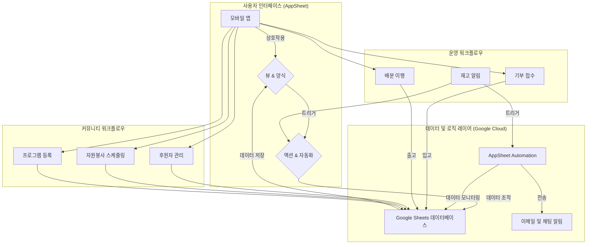

# 🥕 광명시 푸드뱅크 AppSheet 프로젝트

광명푸드뱅크마켓센터의 현장 업무를 누구나 이해할 수 있는 노코드/로우코드 앱으로 전환하기 위한 자료 모음입니다.

---

## 가장 쉬운 시작 (15분 퀵스타트)

완전 초보자라면 아래 순서대로 따라 해 주세요. 필요한 자료는 모두 이 저장소 안에 있습니다.

1. **샘플 데이터 복사:** `database/` 폴더에 있는 CSV 파일을 각각 별도의 워크시트로 업로드합니다. 먼저 핵심 테이블(`Inventories`, `Items`, `Stock`, `Clients`, `Distribution_Events`, `Distribution_Items`, `Donations`, `Donation_Items`, `Donors`)을 넣고, 익숙해지면 커뮤니티 모듈(`Volunteers`, `Volunteer_Shifts`, `Programs`, `Client_Programs`)도 추가하세요.
2. **AppSheet 기본 앱 생성:** [AppSheet](https://www.appsheet.com) -> `Create` -> `App` -> `Start with existing data` 를 눌러 방금 만든 Google Sheet를 선택합니다.
3. **편집기 검사표 확인:** AppSheet 편집기 오른쪽의 "To Do" 패널을 한 항목씩 확인하며 Key/Label/Ref 설정을 맞춰 줍니다. 상세 기준은 `ProjectPrompt.md`를 참고합니다.
4. **첫 자동화 켜 보기:** `ProjectPrompt.md`의 "Automations" 절을 따라 Low Stock 이메일 알림과 기부 접수 시 재고로 전환하는 워크플로우를 함께 켜고 검증합니다.
5. **공유 및 테스트:** AppSheet `Users` 탭에서 동료 이메일을 초대하여 모바일 앱 사용 피드백을 받아 봅니다.

> **더 자세한 설명이 필요하다면?** `AppSheet_Full_Guide.ko.md` 문서를 열어 친절한 스토리텔링 방식의 전체 튜토리얼을 따라가 보세요.

---

## 단계별 학습 로드맵

- **1단계 - 기초 다지기 (30~45분):** 퀵스타트를 마친 뒤 모바일에서 `Stock`과 `Clients` 뷰를 넘겨 보며 테이블 간 연결을 확인합니다.
- **2단계 - 화면 꾸미기 (45~60분):** `ProjectPrompt.md`의 "Views and UX" 절을 참고해 대시보드를 꾸미고, 기부 파이프라인과 배분 기록을 그룹 뷰로 드러냅니다.
- **3단계 - 자동화 완성 (60분 이상):** 기부/배분 액션, 기부-재고 전환 자동화, Low Stock 알림을 구현하고 테스트 데이터를 흘려보내며 검증합니다.
- **4단계 - 커뮤니티 모듈 (선택, 45분 이상):** 자원봉사 스케줄과 프로그램 등록 관리가 필요하면 해당 테이블을 추가로 연결합니다.

워크숍이나 교육에서는 이 로드맵을 칠판이나 슬라이드에 붙여 참가자들이 위치를 확인할 수 있게 해주세요.

---

## 생성형 AI와 함께 만들기

- **아이디어로 앱 만들기:** AppSheet 시작 화면에서 `Create an app from an idea`(Labs)를 선택하고 아래 예시처럼 프롬프트를 입력합니다.
  > "Create a food bank inventory tracker that manages donations, clients, and low-stock alerts."
  생성된 스키마와 이 저장소의 스키마를 비교해 유용한 점을 병합하세요.
- **AppSheet Assistant 활용:** 편집기 오른쪽의 Assistant 아이콘을 눌러 "배분 저장 시 재고를 차감하려면?"처럼 질문하면 필요한 표현식과 단계가 제안됩니다.
- **커뮤니티 모듈 실험:** Assistant에게 자원봉사 교대 알림이나 프로그램 등록 화면을 만드는 방법을 물어보고, 제안된 표현식을 새 테이블에 맞게 조정해 보세요.
- **프롬프트 기록:** 효과적이었던 프롬프트를 Google Sheet 내부 시트에 모아두면, 다음 참가자들이 그대로 재사용할 수 있습니다.

---

## 아키텍처 한눈에 보기

비개발자도 유지관리할 수 있도록 최대한 단순한 구조를 유지했습니다.

### 아키텍처 설명

- **데이터 소스 (Google Sheets):** 하나의 시트 파일 안에 재고, 서비스, 후원자, 자원봉사, 프로그램 테이블이 모두 들어 있어 누구나 한눈에 감사할 수 있습니다.
- **애플리케이션 레이어 (AppSheet):** UI, 검증, 자동화를 노코드로 제공하며 이벤트-라인아이템 구조의 참조를 활용합니다.
- **재고 및 서비스 로직:** `Stock`이 재고 한도를 저장하고 `Distribution_Events`/`Distribution_Items`, `Donations`/`Donation_Items`가 상세 입출고를 기록합니다.
- **커뮤니티 모듈:** `Donors`, `Volunteers`, `Client_Programs` 테이블로 후원자 관리, 봉사 배치, 프로그램 효과 추적을 확장합니다.
- **자동화:** Low Stock, 유통기한, 기부 처리, 자원봉사 알림을 봇으로 예약 실행합니다.

---

## 데이터베이스 스키마 요약

### 핵심 운영 테이블

| Table Name | Role | Key Column | Highlights |
| :--- | :--- | :--- | :--- |
| `Inventories` | 창고 위치와 담당자 정보를 관리 | `Inventory_ID` | 관리자 연락처, 용량, 온도 조건 |
| `Items` | 취급 물품 마스터 카탈로그 | `Item_ID` | 단위, 보관 유형, 식이 태그, 재주문 기준 |
| `Stock` | 물품-창고 연결과 재고 한도 추적 | `Stock_ID` | 재고 임계치, 실사 기록, 보관 위치 |
| `Clients` | 지원 가구(가구명, 언어, 자격) 기록 | `Client_ID` | 가구 규모, 선호 언어, 자격 검토일 |
| `Distribution_Events` | 배분(픽업/배달) 헤더 레코드 | `Distribution_ID` | 수령 방식, 담당자, 서명 캡처 |
| `Distribution_Items` | 배분별 상세 품목 기록 | `Distribution_Item_ID` | 재고 참조, 배분 수량, 결과 메모 |
| `Donations` | 기부 접수 이벤트 | `Donation_ID` | 전달 방식, 서류 여부, 담당자 |
| `Donation_Items` | 기부별 상세 품목 기록 | `Donation_Item_ID` | 입고 창고, 유통기한, 수량 |
| `Donors` | 후원자 프로필 및 선호 채널 | `Donor_ID` | 연락처, 후원 유형, 메모 |

### 커뮤니티 & 프로그램 테이블

| Table Name | Role | Key Column | Highlights |
| :--- | :--- | :--- | :--- |
| `Volunteers` | 자원봉사자 디렉터리 | `Volunteer_ID` | 선호 역할, 가능 시간, 교육 여부 |
| `Volunteer_Shifts` | 배정된 봉사 스케줄 | `Shift_ID` | 날짜, 역할, 진행 상태 |
| `Programs` | 제공 중인 프로그램 목록 | `Program_ID` | 대상 그룹, 활성 여부 |
| `Client_Programs` | 이용자-프로그램 매칭 | `Client_Program_ID` | 등록 상태, 메모 |

> 데모용 데이터가 필요하면 `database/` 폴더의 CSV를 그대로 Google Sheet에 가져오면 됩니다.

---

## 함께 보면 좋은 문서

- `AppSheet_Full_Guide.ko.md`: 스토리텔링 방식의 전체 튜토리얼.
- `ProjectPrompt.md`: 화면/액션/자동화 및 커뮤니티 모듈 설정 체크리스트.
- `README.en.md`: 영어권 팀과 함께 사용할 수 있는 동일 내용의 문서.
