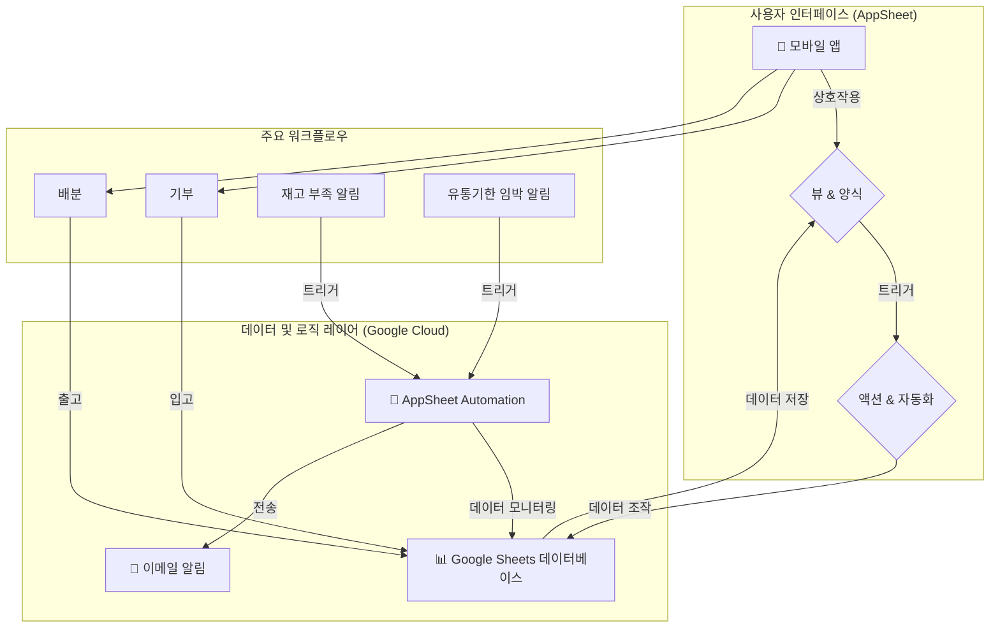

# 🥕 광명시 푸드뱅크 업무 지원 AppSheet 프로젝트

---

## 📝 프로젝트 개요
이 프로젝트는 Google Sheets를 데이터베이스로 사용하여 광명시 푸드뱅크의 **재고 관리, 이용자 배분 활동 기록, 기부 내역 관리** 등 핵심 업무를 지원하는 모바일 기반 AppSheet 애플리케이션을 구축하는 것을 목표로 합니다. 이 애플리케이션은 워크플로우를 간소화하고, 중요 알림을 자동화하며, 푸드뱅크 활동을 관리하기 위한 중앙화된 플랫폼을 제공합니다.

---

## 🏛️ 아키텍처 및 구조
본 아키텍처는 Google Sheets와 AppSheet 간의 강력한 통합을 활용하여 **단순성, 확장성, 낮은 유지보수 비용**에 중점을 두고 설계되었습니다.

### 아키텍처 다이어그램 (Mermaid)

### 아키텍처 설명
*   **데이터 소스 (Google Sheets):** 단일 Google Sheet 파일이 백엔드 데이터베이스 역할을 하며, 상호 연결된 4개의 테이블(워크시트)을 포함합니다. 이 방식은 비용 효율적이며, 비개발자도 필요시 데이터를 직접 확인하고 관리하기 용이합니다.
*   **애플리케이션 레이어 (AppSheet):** AppSheet 플랫폼은 Google Sheet를 읽어와 풍부한 기능의 모바일 애플리케이션을 생성합니다. UI, 데이터 조작 로직(액션), 그리고 비즈니스 규칙을 처리합니다.
*   **사용자 인터페이스 (뷰 & 양식):** 앱은 데이터를 표시하기 위한 직관적인 뷰(대시보드, 덱, 테이블)와 데이터 입력을 위한 사용자 친화적인 양식(예: 신규 배분, 신규 기부)을 제공합니다. AppSheet의 레이블 기능을 사용하여 앱 내에서는 한글로 표시됩니다.
*   **비즈니스 로직 (액션 & 자동화):**
    *   **액션:** 사용자의 상호작용(예: 양식 저장)에 의해 트리거되며, 실시간으로 재고를 업데이트합니다. 예를 들어, 배분 활동이 기록되면 해당 물품의 재고 수량이 자동으로 차감됩니다.
    *   **자동화:** 독립적으로 실행되는 예약된 서버 측 프로세스입니다. 시스템은 매일 재고 부족 및 유통기한 임박 물품을 자동으로 확인하여 담당자에게 이메일 알림을 보냅니다. 이러한 선제적 접근 방식은 낭비를 최소화하고 재고 부족을 예방합니다.

---

## 🚀 사용법 및 설정
1.  **Google Sheet 준비:** `Gwangmyeong Food Bank DB`라는 이름의 새 Google Sheet를 생성합니다.
2.  **워크시트 생성:** 시트 내에 `Inventory`, `Clients`, `Distribution_Log`, `Donation_Log`이라는 정확한 이름의 워크시트 4개를 생성합니다.
3.  **컬럼 정의:** 각 워크시트의 첫 번째 행에 아래 데이터베이스 스키마에 정의된 컬럼 헤더를 입력합니다. 순서와 정확한 영문 이름이 매우 중요합니다.
4.  **AppSheet 연결:**
    *   [AppSheet](https://www.appsheet.com)로 이동하여 새 앱을 시작합니다.
    *   Google 계정에 연결하고 `Gwangmyeong Food Bank DB` 시트를 데이터 소스로 선택합니다.
    *   AppSheet가 자동으로 테이블을 감지합니다.
5.  **앱 구성:** `ProjectPrompt.md`의 명세에 따라 뷰, 액션, 자동화를 구성합니다. AppSheet 내에서 'Label' 설정을 통해 사용자에게 보여지는 필드명을 한글로 지정할 수 있습니다.

---

## 🔗 데이터베이스 스키마 (Table Definitions)
| Table Name | Role | Key Column | Other Important Columns |
| :--- | :--- | :--- | :--- |
| `Inventory` | 마스터 재고 및 유통기한 관리 | `Inventory_ID` | `Item_Name`, `Current_Stock`, `Expiry_Date`, `Address` |
| `Clients` | 대상자 프로필 및 특이사항 관리 | `Client_ID` | `Name`, `Address`, `Allergies_Dietary_Restrictions` |
| `Distribution_Log` | 물품 출고 및 배분 증빙 로그 | `Log_ID` | `Distribution_Date`, `Client_ID`, `Recipient_Signature` |
| `Donation_Log` | 물품 입고 및 후원자 관리 로그 | `Donation_ID` | `Donor_Name`, `Donation_Date`, `Item_Name`, `Quantity`, `Donor_Address` |

**테이블 설명:**
*   **Inventory:** 모든 가용 물품, 현재 수량, 유통기한을 추적합니다.
*   **Clients:** 지원을 받는 개인에 대한 정보(주소, 식단 관련 특이사항 등)를 관리합니다.
*   **Distribution_Log:** 모든 배분 활동에 대한 기록으로, 물품과 수혜자를 연결하고 수령 증빙으로 서명을 캡처합니다.
*   **Donation_Log:** 모든 기부 내역을 추적합니다. 기부자, 기부 물품, 수량, 주소 등의 정보가 포함됩니다. 이 정보는 기부자 관계 관리 및 연말정산과 같은 세금 목적의 기부금 영수증 발급에 매우 중요합니다.
