# 🌱 GM Social Economy MCP

[](https://opensource.org/licenses/MIT)
[](https://modelcontextprotocol.io/)
[](https://www.typescriptlang.org/)

> **광명시 사회적경제 업무 지원을 위한 MCP (Model Context Protocol) 서버**
>
> 공무원분들이 Claude와 대화하며 171개 사회적경제 기업 정보를 검색하고, 통계를 생성하고, 보고서를 작성할 수 있게 도와주는 오픈소스 프로젝트입니다.

---

## 📖 목차

1. [이 프로젝트는 무엇인가요?](#-이-프로젝트는-무엇인가요)
2. [MCP란 무엇인가요?](#-mcp란-무엇인가요)
3. [주요 기능](#-주요-기능)
4. [완전 초보자 가이드](#-완전-초보자-가이드) ⭐ **처음이신 분은 여기부터**
5. [빠른 시작](#-빠른-시작)
6. [테스트 가이드](#-테스트-가이드)
7. [설치 가이드](#-설치-가이드)
8. [사용 방법](#-사용-방법)
9. [나만의 MCP 만들기](#-나만의-mcp-만들기) ⭐ **새로 추가**
10. [프로젝트 구조](#-프로젝트-구조)
11. [개발 가이드](#-개발-가이드)
12. [GitHub에 공유하기](#-github에-공유하기)
13. [기여하기](#-기여하기)
14. [자주 묻는 질문](#-자주-묻는-질문-faq)
15. [문제 해결](#-문제-해결-troubleshooting)
16. [라이선스](#-라이선스)

---

## 🎯 이 프로젝트는 무엇인가요?

### 해결하려는 문제

광명시사회적경제센터 담당 공무원분들은 매일 이런 업무를 하고 계십니다:

| 기존 방식 😓 | MCP 사용 후 😊 |
|------------|---------------|
| 엑셀 파일 열어서 기업 하나하나 찾기 | "소하동 사회적기업 찾아줘" 한 마디로 끝 |
| 수동으로 통계 계산하고 표 만들기 | "유형별 현황 통계 만들어줘"로 자동 생성 |
| 보고서 양식 찾고 데이터 복사/붙여넣기 | "분기 보고서 초안 작성해줘"로 즉시 생성 |

### 목표

> **반복적인 데이터 업무에 쓰는 시간을 줄여서, 
> 더 중요한 일(기업 지원, 정책 개발)에 집중할 수 있게 돕습니다.**

---

## 🤖 MCP란 무엇인가요?

### 쉬운 설명

**MCP (Model Context Protocol)**를 스마트폰에 비유하면:

```mermaid
flowchart LR
    subgraph 비유["🎯 비유로 이해하기"]
        direction LR
        A["📱 스마트폰"] --> B["📲 앱 설치"] --> C["💬 메시지 전송"]
    end
    
    subgraph 실제["✨ 실제 작동 방식"]
        direction LR
        D["🤖 Claude AI"] --> E["🔌 MCP 연결"] --> F["📊 데이터 활용"]
    end
    
    비유 -.->|"같은 원리"| 실제
```

> 💡 **핵심 포인트**: 스마트폰에 카카오톡을 설치하면 메시지를 보낼 수 있듯이,
> Claude에 이 MCP를 연결하면 광명시 사회적경제 데이터를 다룰 수 있어요!

### 기술적 설명 (관심 있는 분들을 위해)

MCP는 Anthropic이 만든 **개방형 프로토콜**입니다:

- **AI 모델**(Claude)과 **외부 데이터/도구**를 연결하는 표준 방식
- 마치 USB가 다양한 기기를 컴퓨터에 연결하는 표준인 것처럼, MCP는 다양한 데이터 소스를 AI에 연결하는 표준
- 공식 문서: [modelcontextprotocol.io](https://modelcontextprotocol.io/)

```mermaid
flowchart LR
    subgraph Client["🖥️ Claude Desktop"]
        A["🤖 Claude AI"]
    end
    
    subgraph MCP["🔌 MCP Server"]
        B["📊 기업 데이터<br/>171개 기업"]
        C["🔍 검색 기능"]
        D["📈 통계 생성"]
        E["📝 보고서 작성"]
    end
    
    A <-->|"JSON-RPC<br/>프로토콜"| B
    A <-->|"도구 호출"| C
    A <-->|"도구 호출"| D
    A <-->|"도구 호출"| E
    
    style Client fill:#e1f5fe
    style MCP fill:#f3e5f5
```



---

## ✨ 주요 기능

### 🔍 Tool 1: 기업 검색 (`search_enterprises`)

자연어로 기업을 검색할 수 있습니다.

```
👩‍💼 "소하동에 있는 사회적기업 찾아줘"
👩‍💼 "카페 운영하는 협동조합 있어?"
👩‍💼 "전화번호가 02-2060으로 시작하는 기업"
```

### 📊 Tool 2: 통계 생성 (`get_statistics`)

다양한 기준으로 통계를 자동 생성합니다.

```
👩‍💼 "유형별 기업 분포 알려줘"
👩‍💼 "지역별 현황 통계 만들어줘"
👩‍💼 "사회적기업과 협동조합 비율 비교"
```

### 📝 Tool 3: 보고서 생성 (`generate_report`)

업무용 보고서 초안을 자동으로 작성합니다.

```
👩‍💼 "이번 분기 사회적경제 현황 보고서 작성해줘"
👩‍💼 "소하동 지역 기업 분석 보고서 만들어줘"
👩‍💼 "시의회 제출용 통계 자료 정리해줘"
```

### 🔄 사용 흐름

```mermaid
sequenceDiagram
    participant 👩‍💼 as 공무원
    participant 🤖 as Claude
    participant 🔌 as MCP Server
    participant 📊 as 기업 데이터

    👩‍💼->>🤖: "소하동 사회적기업 찾아줘"
    🤖->>🔌: search_enterprises 호출
    🔌->>📊: 데이터 조회
    📊-->>🔌: 검색 결과
    🔌-->>🤖: 포맷된 결과
    🤖-->>👩‍💼: 표 형태로 응답
    
    Note over 👩‍💼,📊: 자연어로 질문하면 자동으로 처리됩니다!
```



---

## 👶 완전 초보자 가이드

> 프로그래밍 경험이 없어도 괜찮습니다! 차근차근 따라해 보세요.

### Step 0: 필요한 프로그램 설치하기

MCP를 사용하려면 먼저 몇 가지 프로그램을 설치해야 합니다.

#### 1. Node.js 설치 (필수)

Node.js는 MCP 서버를 실행하는 데 필요한 프로그램입니다.

1. [nodejs.org](https://nodejs.org/) 방문
2. **LTS 버전** (왼쪽 초록색 버튼) 다운로드
3. 다운로드된 파일 실행하여 설치 (모두 "Next" 클릭)
4. 설치 확인:
   ```bash
   # Windows: Win+R → "cmd" 입력 → Enter
   # Mac: Spotlight(Cmd+Space) → "terminal" 입력 → Enter

   node --version
   # v18.0.0 이상이 나오면 성공!
   ```

#### 2. Git 설치 (권장)

Git은 코드를 다운로드하고 관리하는 도구입니다.

1. [git-scm.com](https://git-scm.com/) 방문
2. 운영체제에 맞는 버전 다운로드
3. 설치 (기본 옵션으로 진행)

#### 3. VS Code 설치 (권장)

VS Code는 코드를 보고 편집하는 프로그램입니다.

1. [code.visualstudio.com](https://code.visualstudio.com/) 방문
2. 다운로드 및 설치

#### 4. Claude Desktop 설치

1. [claude.ai/download](https://claude.ai/download) 방문
2. 운영체제에 맞는 버전 다운로드 및 설치

### Step 1: 프로젝트 다운로드

#### 방법 A: Git으로 다운로드 (권장)

```bash
# 터미널/명령 프롬프트에서 실행
git clone https://github.com/durume/GM.git
cd GM/gm-social-economy-center/gm-social-economy-mcp
```

#### 방법 B: ZIP으로 다운로드

1. [GitHub 저장소](https://github.com/durume/GM) 방문
2. 초록색 "Code" 버튼 클릭
3. "Download ZIP" 클릭
4. 압축 해제 후 `gm-social-economy-center/gm-social-economy-mcp` 폴더로 이동

### Step 2: 프로젝트 설치 및 빌드

```bash
# 1. 프로젝트 폴더에서 터미널 열기
# Windows: 폴더에서 Shift+우클릭 → "여기서 터미널 열기"
# Mac: 폴더를 터미널에 드래그

# 2. 필요한 파일 설치 (처음 한 번만)
npm install

# 3. 프로젝트 빌드 (코드 변경 후마다)
npm run build
```

### Step 3: 작동 확인하기

```bash
# MCP Inspector 실행
npm run inspect
```

브라우저가 자동으로 열립니다. 열리지 않으면 직접 `http://localhost:6274` 접속

1. **Connect** 버튼 클릭
2. 왼쪽 **Tools** 탭 클릭
3. `get_statistics` 선택
4. Arguments에 입력: `{"statisticsType": "overview"}`
5. **Run Tool** 클릭
6. 결과로 171개 기업 통계가 나오면 성공! 🎉

### Step 4: Claude Desktop에 연결하기

> **중요**: Claude Desktop은 두 개의 설정 파일을 사용합니다:
> - `config.json` - 일반 설정 (언어, 테마 등) → **수정하지 마세요!**
> - `claude_desktop_config.json` - MCP 서버 설정 → **이 파일을 새로 생성**

#### Windows

1. `Win+R` 키 누르고 다음 입력:
   ```
   %APPDATA%\Claude
   ```
2. `claude_desktop_config.json` 파일을 **새로 생성** (기존 `config.json`은 그대로 두세요!)
3. 다음 내용 입력 (경로는 본인 환경에 맞게 수정):
   ```json
   {
     "mcpServers": {
       "gm-social-economy": {
         "command": "node",
         "args": ["C:\\Users\\사용자이름\\GM\\gm-social-economy-center\\gm-social-economy-mcp\\dist\\index.js"]
       }
     }
   }
   ```
4. 저장 후 Claude Desktop 재시작

#### macOS

1. Finder에서 `Cmd+Shift+G` 누르고 입력:
   ```
   ~/Library/Application Support/Claude
   ```
2. `claude_desktop_config.json` 파일 편집 (없으면 새로 만들기)
3. 다음 내용 입력:
   ```json
   {
     "mcpServers": {
       "gm-social-economy": {
         "command": "node",
         "args": ["/Users/사용자이름/GM/gm-social-economy-center/gm-social-economy-mcp/dist/index.js"]
       }
     }
   }
   ```
4. 저장 후 Claude Desktop 재시작

### Step 5: Claude에서 사용하기

Claude Desktop에서 이렇게 물어보세요:

```
광명시 사회적경제 기업이 몇 개야?
```

"171개" 라고 답하면 연결 성공입니다! 🎉

이제 자유롭게 질문해 보세요:
- "소하동에 있는 협동조합 찾아줘"
- "유형별 통계 만들어줘"
- "이번 분기 보고서 작성해줘"

---

## 🚀 빠른 시작

### 설치 흐름

```mermaid
flowchart LR
    A["📥 Clone"] --> B["📦 npm install"]
    B --> C["🔨 npm run build"]
    C --> D["⚙️ 설정 파일 수정"]
    D --> E["🔄 Claude 재시작"]
    E --> F["✅ 완료!"]
    
    style A fill:#e8f5e9
    style F fill:#c8e6c9
```



### 전제 조건

시작하기 전에 다음이 설치되어 있어야 합니다:

- ✅ **Node.js** (버전 18 이상) - [다운로드](https://nodejs.org/)
- ✅ **VS Code** - [다운로드](https://code.visualstudio.com/)
- ✅ **Claude Desktop** 또는 **Claude Code** - [다운로드](https://claude.ai/download)

### 5분 안에 시작하기

```bash
# 1. 저장소 클론 (이미 GM 저장소가 있다면 건너뛰세요)
git clone https://github.com/durume/GM.git
cd GM

# 2. MCP 프로젝트 폴더로 이동
cd gm-social-economy-center/gm-social-economy-mcp

# 3. 의존성 설치
npm install

# 4. 빌드
npm run build

# 5. 테스트 (MCP Inspector로 바로 확인)
npm run inspect
```

---

## 🧪 테스트 가이드

### MCP Inspector로 테스트하기 (권장)

MCP Inspector는 Claude 연결 없이 MCP 서버를 테스트할 수 있는 공식 도구입니다.

```bash
# 프로젝트 폴더에서 실행
npm run inspect
```

브라우저가 자동으로 열리고 `http://localhost:6274` 에서 테스트할 수 있습니다.

#### 테스트 순서

1. **Connect 버튼 클릭** - MCP 서버에 연결
2. **Tools 탭 선택** - 사용 가능한 도구 목록 확인
3. **도구 선택 후 테스트** - 아래 예시 참고

#### 테스트 예시

| 도구 | 테스트 파라미터 | 설명 |
|------|----------------|------|
| `search_enterprises` | `{"region": "소하동"}` | 소하동 기업 검색 |
| `search_enterprises` | `{"type": "협동조합"}` | 협동조합만 검색 |
| `search_enterprises` | `{"keyword": "카페"}` | 카페 관련 기업 검색 |
| `get_statistics` | `{"statisticsType": "overview"}` | 전체 현황 통계 |
| `get_statistics` | `{"statisticsType": "byType"}` | 유형별 통계 |
| `get_statistics` | `{"statisticsType": "byRegion"}` | 지역별 통계 |
| `generate_report` | `{"reportType": "summary"}` | 요약 보고서 생성 |
| `generate_report` | `{"reportType": "quarterly"}` | 분기 보고서 생성 |

#### Resources 탭에서 테스트

| 리소스 URI | 설명 |
|-----------|------|
| `gm-social-economy://metadata` | 데이터 메타정보 (출처, 업데이트일 등) |
| `gm-social-economy://summary` | 전체 현황 요약 |

### 테스트 종료

테스트가 끝나면 터미널에서 `Ctrl+C`를 눌러 Inspector를 종료하세요.

---

## 📦 설치 가이드

### Step 1: Node.js 설치 확인

터미널(명령 프롬프트)을 열고 다음을 입력하세요:

```bash
node --version
```

`v18.0.0` 이상이 표시되면 OK! 아니라면 [Node.js 공식 사이트](https://nodejs.org/)에서 설치하세요.

### Step 2: 프로젝트 설치

```bash
# GM 저장소 폴더에서
cd gm-social-economy-mcp

# 필요한 패키지 설치
npm install

# TypeScript 빌드
npm run build
```

### Step 3: Claude Desktop 설정

Claude Desktop의 설정 파일을 수정해야 합니다.

#### Windows의 경우:

설정 파일 위치: `%APPDATA%\Claude\claude_desktop_config.json`

```json
{
  "mcpServers": {
    "gm-social-economy": {
      "command": "node",
      "args": ["C:\\Users\\YourName\\path\\to\\GM\\gm-social-economy-mcp\\dist\\index.js"],
      "env": {}
    }
  }
}
```

#### macOS의 경우:

설정 파일 위치: `~/Library/Application Support/Claude/claude_desktop_config.json`

```json
{
  "mcpServers": {
    "gm-social-economy": {
      "command": "node",
      "args": ["/Users/YourName/path/to/GM/gm-social-economy-mcp/dist/index.js"],
      "env": {}
    }
  }
}
```

### Step 4: Claude Desktop 재시작

설정 저장 후 Claude Desktop을 완전히 종료했다가 다시 실행하세요.

### Step 5: 연결 확인

Claude Desktop에서 다음과 같이 물어보세요:

```
광명시 사회적경제 기업 몇 개 등록되어 있어?
```

정상적으로 "171개"라고 답하면 성공입니다! 🎉

---

## 💬 사용 방법

### 기업 검색 예시

```
# 지역으로 검색
👩‍💼: 소하동에 있는 기업 목록 보여줘

# 유형으로 검색
👩‍💼: 사회적협동조합만 찾아줘

# 키워드로 검색
👩‍💼: 돌봄 서비스 제공하는 기업 있어?

# 복합 검색
👩‍💼: 철산동에 있는 마을기업 중에 카페 운영하는 곳
```

### 통계 생성 예시

```
# 기본 통계
👩‍💼: 전체 현황 통계 알려줘

# 유형별 분석
👩‍💼: 유형별로 몇 개씩 있는지 표로 만들어줘

# 지역별 분석
👩‍💼: 어느 동에 기업이 가장 많아?

# 비교 분석
👩‍💼: 소하동과 철산동 기업 수 비교해줘
```

### 보고서 생성 예시

```
# 전체 현황 보고서
👩‍💼: 2024년 4분기 사회적경제 현황 보고서 작성해줘

# 지역 분석 보고서
👩‍💼: 하안동 지역 사회적경제 기업 분석 보고서 만들어줘

# 간단한 요약
👩‍💼: 시의회 보고용으로 한 페이지 요약 만들어줘
```

---

## 🛠️ 나만의 MCP 만들기

> 이 프로젝트를 템플릿으로 사용하여 자신만의 MCP 서버를 만들어 보세요!

### 어떤 MCP를 만들 수 있나요?

| 예시 | 데이터 | 도구 |
|------|--------|------|
| 도서관 장서 검색 | 도서 목록 JSON | 검색, 대출현황, 추천 |
| 음식점 정보 | 맛집 데이터 | 지역별 검색, 평점 통계 |
| 회사 직원 관리 | 직원 정보 | 부서별 검색, 조직도 |
| 제품 재고 관리 | 상품 데이터 | 재고 조회, 발주 알림 |

### Step 1: 이 프로젝트 복사하기

```bash
# 1. 프로젝트 복사
cp -r gm-social-economy-mcp my-custom-mcp
cd my-custom-mcp

# 2. 이름 변경 (package.json)
# "name": "my-custom-mcp" 으로 수정
```

### Step 2: 데이터 파일 만들기

`src/data/enterprises.json`을 참고하여 자신의 데이터 파일을 만드세요.

```json
{
  "metadata": {
    "source": "내 데이터 출처",
    "lastUpdated": "2024-12-20",
    "totalItems": 100
  },
  "items": [
    {
      "id": 1,
      "name": "항목 이름",
      "category": "분류",
      "description": "설명"
    }
  ]
}
```

### Step 3: 타입 정의하기

`src/data/types.ts`에서 데이터 타입을 정의하세요.

```typescript
// 내 데이터 타입 정의
export interface MyItem {
  id: number;
  name: string;
  category: string;
  description: string;
}

export interface MyData {
  metadata: {
    source: string;
    lastUpdated: string;
    totalItems: number;
  };
  items: MyItem[];
}
```

### Step 4: 도구 만들기

`src/tools/` 폴더에 새 도구 파일을 만드세요.

```typescript
// src/tools/searchItems.ts
import { loadData } from "../data/loader.js";
import type { ToolResult } from "../data/types.js";

// 도구 스키마 정의
export const searchItemsSchema = {
  type: "object" as const,
  properties: {
    keyword: {
      type: "string",
      description: "검색할 키워드",
    },
    category: {
      type: "string",
      description: "분류로 필터링",
    },
  },
};

// 도구 함수 구현
export async function searchItems(args: any): Promise<ToolResult> {
  const data = await loadData();
  let results = data.items;

  // 키워드 필터링
  if (args.keyword) {
    results = results.filter(item =>
      item.name.includes(args.keyword) ||
      item.description.includes(args.keyword)
    );
  }

  // 분류 필터링
  if (args.category) {
    results = results.filter(item => item.category === args.category);
  }

  return {
    content: [{
      type: "text",
      text: `검색 결과: ${results.length}개\n\n` +
            results.map(item => `- ${item.name}: ${item.description}`).join("\n"),
    }],
  };
}

// 도구 정의 (index.ts에서 사용)
export const searchItemsTool = {
  name: "search_items",
  description: "항목을 검색합니다",
  inputSchema: searchItemsSchema,
};
```

### Step 5: 서버에 도구 등록

`src/index.ts`에서 새 도구를 등록하세요.

```typescript
// 도구 임포트 추가
import { searchItems, searchItemsTool } from "./tools/searchItems.js";

// ListToolsRequestSchema에 도구 추가
server.setRequestHandler(ListToolsRequestSchema, async () => {
  return {
    tools: [
      searchItemsTool,
      // 다른 도구들...
    ],
  };
});

// CallToolRequestSchema에 처리 추가
server.setRequestHandler(CallToolRequestSchema, async (request) => {
  switch (request.params.name) {
    case "search_items":
      return await searchItems(request.params.arguments);
    // 다른 도구들...
  }
});
```

### Step 6: 빌드 및 테스트

```bash
# 빌드
npm run build

# 테스트
npm run inspect
```

---

## 🌐 GitHub에 공유하기

### MCP 프로젝트를 GitHub에 올리기

#### 1. GitHub 저장소 생성

1. [github.com](https://github.com) 로그인
2. 오른쪽 위 `+` 버튼 → "New repository"
3. Repository name 입력 (예: `my-city-mcp`)
4. "Create repository" 클릭

#### 2. 코드 업로드

```bash
# 프로젝트 폴더에서
git init
git add .
git commit -m "Initial commit: My MCP Server"

# GitHub 저장소 연결 (URL은 본인 저장소로 변경)
git remote add origin https://github.com/사용자명/my-city-mcp.git
git branch -M main
git push -u origin main
```

### GitHub Pages로 문서 사이트 만들기

> **참고**: MCP 서버는 Node.js 프로그램이므로 GitHub Pages에서 직접 실행할 수 없습니다.
> GitHub Pages는 **문서 사이트**를 호스팅하는 용도로 사용합니다.

#### 1. 문서 사이트 만들기

`docs/` 폴더에 웹 페이지를 만드세요:

```html
<!-- docs/index.html -->
<!DOCTYPE html>
<html lang="ko">
<head>
  <meta charset="UTF-8">
  <title>My MCP Server - 문서</title>
  <style>
    body { font-family: sans-serif; max-width: 800px; margin: 0 auto; padding: 20px; }
    h1 { color: #333; }
    code { background: #f4f4f4; padding: 2px 6px; border-radius: 3px; }
    pre { background: #f4f4f4; padding: 15px; border-radius: 5px; overflow-x: auto; }
  </style>
</head>
<body>
  <h1>🚀 My MCP Server</h1>
  <p>Claude AI와 함께 사용할 수 있는 MCP 서버입니다.</p>

  <h2>설치 방법</h2>
  <pre><code>git clone https://github.com/사용자명/my-city-mcp.git
cd my-city-mcp
npm install
npm run build</code></pre>

  <h2>사용 방법</h2>
  <pre><code>npm run inspect</code></pre>

  <h2>제공 도구</h2>
  <ul>
    <li><strong>search_items</strong> - 항목 검색</li>
    <li><strong>get_statistics</strong> - 통계 생성</li>
  </ul>

  <h2>GitHub 저장소</h2>
  <p><a href="https://github.com/사용자명/my-city-mcp">소스 코드 보기</a></p>
</body>
</html>
```

#### 2. GitHub Pages 활성화

1. GitHub 저장소 → "Settings" 탭
2. 왼쪽 메뉴에서 "Pages" 클릭
3. Source: "Deploy from a branch" 선택
4. Branch: `main`, Folder: `/docs` 선택
5. "Save" 클릭

몇 분 후 `https://사용자명.github.io/my-city-mcp/` 에서 문서 사이트가 공개됩니다!

### 다른 사람이 내 MCP 사용하기

다른 사람들은 이렇게 사용할 수 있습니다:

```bash
# 1. 저장소 클론
git clone https://github.com/사용자명/my-city-mcp.git
cd my-city-mcp

# 2. 설치 및 빌드
npm install
npm run build

# 3. Claude Desktop 설정에 추가
# claude_desktop_config.json 수정
```

---

## 📁 프로젝트 구조

### 아키텍처 개요

```mermaid
flowchart TB
    subgraph Entry["🚀 진입점"]
        INDEX["index.ts<br/>MCP 서버"]
    end
    
    subgraph Tools["🔧 도구 (Tools)"]
        SEARCH["searchEnterprises.ts<br/>기업 검색"]
        STATS["getStatistics.ts<br/>통계 생성"]
        REPORT["generateReport.ts<br/>보고서 작성"]
    end
    
    subgraph Data["📊 데이터"]
        LOADER["loader.ts<br/>데이터 로딩"]
        TYPES["types.ts<br/>타입 정의"]
        JSON["enterprises.json<br/>171개 기업"]
    end
    
    subgraph Utils["🛠️ 유틸리티"]
        FILTER["filters.ts<br/>필터링"]
        STAT["statistics.ts<br/>통계 계산"]
        FORMAT["formatters.ts<br/>포맷팅"]
    end
    
    INDEX --> SEARCH
    INDEX --> STATS
    INDEX --> REPORT
    
    SEARCH --> LOADER
    STATS --> LOADER
    REPORT --> LOADER
    
    LOADER --> JSON
    LOADER --> TYPES
    
    SEARCH --> FILTER
    STATS --> STAT
    REPORT --> FORMAT
    
    style Entry fill:#bbdefb
    style Tools fill:#c8e6c9
    style Data fill:#fff9c4
    style Utils fill:#f8bbd9
```



### 폴더 구조

```
gm-social-economy-mcp/
│
├── 📄 README.md                # 이 파일 (프로젝트 소개)
├── 📄 package.json             # 프로젝트 설정 및 의존성
├── 📄 tsconfig.json            # TypeScript 설정
├── 📄 .gitignore               # Git 제외 파일 목록
│
├── 📁 src/                     # 소스 코드
│   ├── 📄 index.ts             # MCP 서버 메인 진입점
│   │
│   ├── 📁 tools/               # MCP 도구 구현
│   │   ├── 📄 searchEnterprises.ts   # 기업 검색
│   │   ├── 📄 getStatistics.ts       # 통계 생성
│   │   └── 📄 generateReport.ts      # 보고서 생성
│   │
│   ├── 📁 data/                # 데이터 관련
│   │   ├── 📄 loader.ts        # 데이터 로딩 함수
│   │   ├── 📄 types.ts         # TypeScript 타입 정의
│   │   └── 📄 enterprises.json # 171개 기업 데이터
│   │
│   └── 📁 utils/               # 유틸리티 함수
│       ├── 📄 filters.ts       # 필터링 헬퍼
│       ├── 📄 statistics.ts    # 통계 계산
│       └── 📄 formatters.ts    # 출력 포맷팅
│
├── 📁 dist/                    # 빌드된 JavaScript (자동 생성)
│
├── 📁 docs/                    # 추가 문서
│   ├── 📄 INSTALLATION.md      # 상세 설치 가이드
│   ├── 📄 USER_GUIDE.md        # 사용자 가이드
│   └── 📄 DEVELOPER_GUIDE.md   # 개발자 가이드
│
└── 📁 examples/                # 사용 예시
    └── 📄 conversations.md     # 대화 예시 모음
```

### 각 파일의 역할

| 파일 | 역할 | 비유 |
|------|------|------|
| `index.ts` | MCP 서버의 시작점 | 가게의 정문 |
| `tools/*.ts` | 실제 기능 구현 | 가게 안의 각 코너(검색 코너, 통계 코너...) |
| `data/loader.ts` | 데이터 불러오기 | 창고에서 물건 가져오기 |
| `data/types.ts` | 데이터 형태 정의 | 물건 분류 체계 |
| `utils/*.ts` | 공통으로 쓰는 기능 | 다용도 도구함 |

---

## 🔧 개발 가이드

### 개발 환경 설정

```bash
# 의존성 설치
npm install

# 개발 모드 실행 (파일 변경 시 자동 재빌드)
npm run dev

# 타입 체크
npm run typecheck

# 빌드
npm run build
```

### 코드 구조 이해하기

#### 1. MCP 서버 기본 구조 (`src/index.ts`)

```typescript
// MCP 서버는 이렇게 생겼습니다
import { Server } from "@modelcontextprotocol/sdk/server/index.js";

const server = new Server({
  name: "gm-social-economy",
  version: "1.0.0",
});

// 도구(Tool) 등록
server.setRequestHandler(ListToolsRequestSchema, async () => {
  return {
    tools: [
      {
        name: "search_enterprises",
        description: "광명시 사회적경제 기업을 검색합니다",
        inputSchema: {
          // 입력 파라미터 정의
        },
      },
      // ... 다른 도구들
    ],
  };
});

// 도구 실행 처리
server.setRequestHandler(CallToolRequestSchema, async (request) => {
  switch (request.params.name) {
    case "search_enterprises":
      return searchEnterprises(request.params.arguments);
    // ... 다른 도구들
  }
});
```

#### 2. 도구 구현 예시 (`src/tools/searchEnterprises.ts`)

```typescript
// 기업 검색 도구
export async function searchEnterprises(args: SearchArgs): Promise<ToolResult> {
  // 1. 데이터 로드
  const enterprises = await loadEnterprises();
  
  // 2. 필터링
  let results = enterprises;
  
  if (args.region) {
    results = results.filter(e => e.region === args.region);
  }
  
  if (args.type) {
    results = results.filter(e => e.type === args.type);
  }
  
  if (args.keyword) {
    results = results.filter(e => 
      e.name.includes(args.keyword) || 
      e.product.includes(args.keyword)
    );
  }
  
  // 3. 결과 반환
  return {
    content: [
      {
        type: "text",
        text: formatResults(results),
      },
    ],
  };
}
```

### 새로운 도구 추가하기

1. `src/tools/` 폴더에 새 파일 생성
2. 도구 함수 구현
3. `src/index.ts`에 도구 등록
4. 빌드 및 테스트

### 디버깅 팁

```bash
# MCP Inspector로 테스트 (권장)
npx @modelcontextprotocol/inspector node dist/index.js

# 로그 확인
# Claude Desktop 로그 위치:
# - Windows: %APPDATA%\Claude\logs\
# - macOS: ~/Library/Logs/Claude/
```

---

## 🤝 기여하기

이 프로젝트는 오픈소스입니다! 누구나 기여할 수 있습니다.

### 기여 워크플로우

```mermaid
flowchart LR
    A["🍴 Fork"] --> B["🌿 Branch 생성"]
    B --> C["✏️ 코드 수정"]
    C --> D["✅ 테스트"]
    D --> E["📤 Push"]
    E --> F["🔀 Pull Request"]
    F --> G["🎉 Merge!"]
    
    style A fill:#e3f2fd
    style G fill:#c8e6c9
```



### 기여 방법

1. **이슈 등록**: 버그 발견, 기능 제안 → [GitHub Issues](https://github.com/durume/GM/issues)
2. **코드 기여**: Fork → 수정 → Pull Request
3. **문서 개선**: 오타 수정, 설명 추가 등
4. **사용 후기**: 어떻게 활용했는지 공유해 주세요!

### 기여자를 위한 가이드라인

- 한국어와 영어 모두 환영합니다
- 커밋 메시지는 명확하게 작성해 주세요
- 새 기능은 관련 문서도 함께 업데이트해 주세요

---

## 📊 데이터 출처

- **기업 데이터**: [광명시사회적경제센터](https://gmsocial.or.kr/map) (2024년 11월 기준)
- **총 171개 기업**: 사회적기업, (예비)사회적기업, 협동조합, 사회적협동조합, 마을기업

### 기업 유형별 분포 (예시)

```mermaid
pie showData
    title 사회적경제 기업 유형별 분포
    "협동조합" : 58
    "사회적기업" : 45
    "(예비)사회적기업" : 32
    "사회적협동조합" : 24
    "마을기업" : 12
```



---

## ❓ 자주 묻는 질문 (FAQ)

### Q: `config.json`과 `claude_desktop_config.json`의 차이점은?

**A:** Claude Desktop은 두 개의 별도 설정 파일을 사용합니다:

| 파일 | 용도 | 수정 여부 |
|------|------|----------|
| `config.json` | 앱 일반 설정 (언어, 테마, 스케일) | ❌ 건드리지 마세요 |
| `claude_desktop_config.json` | **MCP 서버 설정** | ✅ 이 파일을 생성/편집 |

두 파일은 같은 폴더(`%APPDATA%\Claude`)에 공존하며, 서로 독립적으로 작동합니다.
**`config.json`을 수정하거나 삭제하면 Claude Desktop 설정이 초기화됩니다!**

### Q: MCP가 작동하지 않아요

**A:** 다음을 확인해 보세요:
1. Node.js 버전이 18 이상인가요? (`node --version`)
2. `npm run build`를 실행했나요?
3. Claude Desktop 설정 파일의 경로가 정확한가요?
4. Claude Desktop을 재시작했나요?

### Q: "데이터 파일을 불러올 수 없습니다" 오류가 발생해요

**A:** `enterprises.json` 파일이 `dist/data/` 폴더에 없을 수 있습니다.

```bash
# 다시 빌드하면 자동으로 복사됩니다
npm run build
```

### Q: "Port is in use" 오류가 발생해요

**A:** 이전에 실행한 Inspector가 종료되지 않았을 수 있습니다.

```bash
# Windows: 포트 사용 중인 프로세스 종료
netstat -ano | findstr :6274
taskkill /PID [프로세스ID] /F

# macOS/Linux:
lsof -i :6274
kill -9 [프로세스ID]
```

### Q: 데이터를 업데이트하고 싶어요

**A:** `src/data/enterprises.json` 파일을 수정한 후 다시 빌드하세요:

```bash
npm run build
```

### Q: 다른 도시에서도 사용할 수 있나요?

**A:** 네! `enterprises.json` 데이터만 해당 도시 데이터로 교체하면 됩니다.
이 프로젝트를 Fork해서 자유롭게 수정하세요.

### Q: Claude Code에서 사용하려면?

**A:** Claude Code 설정에서 MCP 서버를 추가하세요:

```bash
# Claude Code 설정 열기
claude mcp add gm-social-economy node /path/to/dist/index.js
```

---

## 🔧 문제 해결 (Troubleshooting)

| 증상 | 원인 | 해결 방법 |
|------|------|----------|
| `npm run build` 실패 | TypeScript 오류 | `npm run typecheck`로 오류 확인 |
| 데이터 파일 없음 오류 | JSON 파일 누락 | `npm run build` 재실행 |
| Port 6274/6277 사용 중 | 이전 프로세스 미종료 | 프로세스 강제 종료 후 재시작 |
| Claude Desktop 연결 안됨 | 설정 파일 경로 오류 | 절대 경로로 수정 후 재시작 |
| 검색 결과 0개 | 잘못된 필터 값 | 지역명/유형명 정확히 입력 |

---

## 📜 라이선스

MIT License - 자유롭게 사용, 수정, 배포할 수 있습니다.

자세한 내용은 [LICENSE](./LICENSE) 파일을 참조하세요.

---

## 🙏 감사의 말

- [Anthropic](https://anthropic.com) - Claude와 MCP 개발
- [광명시사회적경제센터](https://gmsocial.or.kr) - 데이터 제공
- 모든 기여자분들

---

<div align="center">

**Made with ❤️ for 광명시 사회적경제**

[🐛 버그 신고](https://github.com/durume/GM/issues) · 
[💡 기능 제안](https://github.com/durume/GM/issues) · 
[📖 문서](./docs/)

</div>
