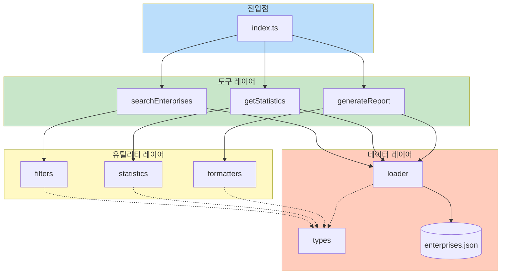
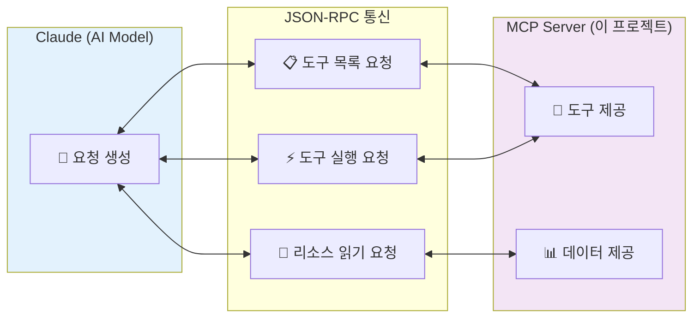
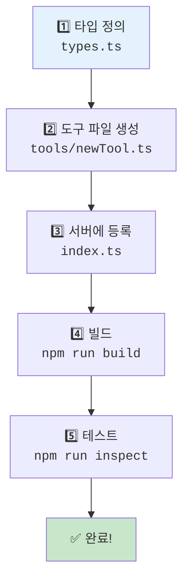

# 👨‍💻 개발자 가이드

이 가이드는 `gm-social-economy-mcp`를 수정하거나 확장하려는 개발자를 위한 문서입니다.

---

## 📋 목차

1. [개발 환경 설정](#-개발-환경-설정)
2. [프로젝트 구조 이해](#-프로젝트-구조-이해)
3. [MCP 개념 이해](#-mcp-개념-이해)
4. [새로운 도구 추가하기](#-새로운-도구-추가하기)
5. [데이터 업데이트](#-데이터-업데이트)
6. [테스트 및 디버깅](#-테스트-및-디버깅)
7. [배포](#-배포)

---

## 🛠️ 개발 환경 설정

### 필수 도구

- Node.js 18+
- npm 또는 yarn
- VS Code (권장)
- Git

### 설치 및 실행

```bash
# 저장소 클론
git clone https://github.com/durume/GM.git
cd GM/gm-social-economy-mcp

# 의존성 설치
npm install

# 개발 모드 (파일 변경 시 자동 재빌드)
npm run dev

# 빌드
npm run build

# 타입 체크
npm run typecheck
```

### VS Code 확장 프로그램 (권장)

- **ESLint** - 코드 품질 검사
- **Prettier** - 코드 포맷팅
- **TypeScript Hero** - TypeScript 지원
- **Claude Dev** - Claude Code 연동

---

## 📁 프로젝트 구조 이해

### 모듈 의존성 다이어그램



### 폴더 구조

```
gm-social-economy-mcp/
├── src/
│   ├── index.ts              # 🚀 MCP 서버 진입점
│   │
│   ├── tools/                # 🔧 MCP 도구들
│   │   ├── searchEnterprises.ts    # 기업 검색
│   │   ├── getStatistics.ts        # 통계 생성
│   │   └── generateReport.ts       # 보고서 생성
│   │
│   ├── data/                 # 📊 데이터 관련
│   │   ├── types.ts          # TypeScript 타입 정의
│   │   ├── loader.ts         # 데이터 로딩 함수
│   │   └── enterprises.json  # 기업 데이터
│   │
│   └── utils/                # 🛠️ 유틸리티
│       ├── filters.ts        # 필터링 함수
│       ├── statistics.ts     # 통계 계산
│       └── formatters.ts     # 출력 포맷팅
│
├── dist/                     # 빌드 결과물 (자동 생성)
├── docs/                     # 문서
├── package.json
└── tsconfig.json
```

### 핵심 파일 설명

| 파일 | 역할 |
|------|------|
| `src/index.ts` | MCP 서버 시작, 도구 등록, 요청 처리 |
| `src/tools/*.ts` | 각 도구의 실제 구현 |
| `src/data/types.ts` | 모든 데이터 타입 정의 |
| `src/data/loader.ts` | JSON 파일에서 데이터 로드 |
| `src/utils/*.ts` | 재사용 가능한 헬퍼 함수 |

---

## 🔌 MCP 개념 이해

### MCP란?

**Model Context Protocol (MCP)**는 AI 모델에게 외부 데이터와 기능을 제공하는 표준 프로토콜입니다.



### MCP의 3가지 핵심 개념

#### 1. Tools (도구)

Claude가 실행할 수 있는 함수입니다.

```typescript
// 도구 정의
{
  name: "search_enterprises",
  description: "기업을 검색합니다",
  inputSchema: {
    type: "object",
    properties: {
      keyword: { type: "string", description: "검색 키워드" }
    }
  }
}
```

#### 2. Resources (리소스)

Claude가 읽을 수 있는 데이터입니다.

```typescript
// 리소스 정의
{
  uri: "gm://metadata",
  name: "메타데이터",
  description: "데이터 정보",
  mimeType: "application/json"
}
```

#### 3. Prompts (프롬프트)

미리 정의된 대화 템플릿입니다. (이 프로젝트에서는 미사용)

---

## ➕ 새로운 도구 추가하기

### 도구 추가 워크플로우



### Step 1: 타입 정의 (선택사항)

`src/data/types.ts`에 필요한 타입을 추가합니다:

```typescript
// 새로운 도구의 파라미터 타입
export interface NewToolParams {
  param1: string;
  param2?: number;
}
```

### Step 2: 도구 파일 생성

`src/tools/newTool.ts` 파일을 만듭니다:

```typescript
/**
 * 새로운 도구 (new_tool)
 */

import type { ToolResult } from "../data/types.js";

// 입력 스키마 정의
export const newToolSchema = {
  type: "object" as const,
  properties: {
    param1: {
      type: "string",
      description: "첫 번째 파라미터",
    },
    param2: {
      type: "number",
      description: "두 번째 파라미터 (선택)",
    },
  },
  required: ["param1"],
};

// 도구 실행 함수
export async function newTool(args: { param1: string; param2?: number }): Promise<ToolResult> {
  try {
    // 로직 구현
    const result = `처리 결과: ${args.param1}`;
    
    return {
      content: [{
        type: "text",
        text: result,
      }],
    };
  } catch (error) {
    return {
      content: [{
        type: "text",
        text: `오류: ${error instanceof Error ? error.message : "알 수 없는 오류"}`,
      }],
      isError: true,
    };
  }
}

// 도구 정의 객체
export const newToolDef = {
  name: "new_tool",
  description: "새로운 도구 설명",
  inputSchema: newToolSchema,
};
```

### Step 3: 서버에 등록

`src/index.ts`를 수정합니다:

```typescript
// 임포트 추가
import { newTool, newToolDef } from "./tools/newTool.js";

// ListToolsRequestSchema 핸들러에 추가
server.setRequestHandler(ListToolsRequestSchema, async () => {
  return {
    tools: [
      searchEnterprisesTool,
      getStatisticsTool,
      generateReportTool,
      newToolDef,  // 👈 추가
    ],
  };
});

// CallToolRequestSchema 핸들러에 case 추가
case "new_tool":
  return await newTool(args as any);
```

### Step 4: 빌드 및 테스트

```bash
npm run build
npm run inspect  # MCP Inspector로 테스트
```

---

## 📊 데이터 업데이트

### 기업 데이터 교체

1. `src/data/enterprises.json` 파일을 수정하거나 교체
2. 형식은 기존 구조를 따라야 함:

```json
{
  "metadata": {
    "source": "출처",
    "lastUpdated": "2024-12-20",
    "totalEnterprises": 171,
    ...
  },
  "enterprises": [
    {
      "id": 1,
      "name": "기업명",
      "type": "사회적기업",
      "phone": "02-xxxx-xxxx",
      "product": "주요 사업",
      "address": "주소",
      "region": "소하동"
    },
    ...
  ]
}
```

3. 메타데이터의 `totalEnterprises`와 실제 기업 수가 일치해야 함

### 전체 데이터 사용하기

기존 대시보드의 데이터를 사용하려면:

```bash
# 대시보드 데이터 복사
cp ../gwangmyeong-dashboard/public/data/enterprises.json src/data/enterprises.json
```

---

## 🧪 테스트 및 디버깅

### MCP Inspector 사용

MCP Inspector는 MCP 서버를 테스트하는 공식 도구입니다:

```bash
npm run inspect
# 또는
npx @modelcontextprotocol/inspector node dist/index.js
```

브라우저에서 `http://localhost:5173`으로 접속하여 도구를 테스트할 수 있습니다.

### 로그 확인

```typescript
// 서버에서 로그 출력 (stderr 사용)
console.error("디버그 메시지:", someData);
```

Claude Desktop 로그 위치:
- Windows: `%APPDATA%\Claude\logs\`
- macOS: `~/Library/Logs/Claude/`

### 일반적인 오류와 해결책

| 오류 | 원인 | 해결책 |
|------|------|--------|
| `Cannot find module` | 빌드 안 됨 | `npm run build` 실행 |
| `Invalid JSON` | JSON 문법 오류 | JSON 파일 문법 확인 |
| `Tool not found` | 도구 미등록 | `index.ts`에 등록 확인 |
| `Type error` | 타입 불일치 | `types.ts` 확인 |

---

## 🚀 배포

### 배포 옵션 비교

| 옵션 | 난이도 | 비용 | 적합한 경우 |
|------|--------|------|-------------|
| **로컬** | 쉬움 | 무료 | 개인 사용, 개발 |
| **Railway** | 쉬움 | $5/월 크레딧 | 빠른 프로토타입 |
| **Render** | 쉬움 | 무료 티어 있음 | 소규모 프로젝트 |
| **Azure** | 중간 | 종량제 | 기업/정부 프로젝트 |
| **GCP** | 중간 | 종량제 | 확장성 필요시 |

---

## ☁️ 클라우드 배포

### Railway 배포 (가장 쉬움)

[Railway](https://railway.app)는 GitHub 연동으로 자동 배포가 가능한 PaaS입니다.

#### Step 1: Railway 계정 생성
1. [railway.app](https://railway.app) 방문
2. GitHub 계정으로 로그인

#### Step 2: 프로젝트 생성
```bash
# Railway CLI 설치
npm install -g @railway/cli

# 로그인
railway login

# 프로젝트 폴더에서 초기화
railway init

# 배포
railway up
```

#### Step 3: 환경 설정
Railway 대시보드에서:
1. Variables 탭 → 환경 변수 설정 (필요시)
2. Settings → Start Command: `npm run start`

#### Railway 배포 결과
배포 후 URL 제공: `https://your-project.up.railway.app`

---

### Render 배포

[Render](https://render.com)는 무료 티어가 있는 클라우드 플랫폼입니다.

#### Step 1: render.yaml 생성

프로젝트 루트에 `render.yaml` 파일 생성:

```yaml
services:
  - type: web
    name: gm-social-economy-mcp
    env: node
    buildCommand: npm install && npm run build
    startCommand: npm run start
    envVars:
      - key: NODE_ENV
        value: production
```

#### Step 2: Render에서 배포
1. [render.com](https://render.com) 로그인
2. **New** → **Web Service**
3. GitHub 저장소 연결
4. 자동 배포 설정

> **참고**: Render 무료 티어는 15분 비활성 시 슬립 모드로 전환됩니다.

---

### Azure 배포 (기업/정부용 권장)

Azure는 한국 리전과 정부 인증을 지원하여 공공기관에 적합합니다.

#### 방법 1: Azure App Service

```bash
# Azure CLI 설치 후
az login

# 리소스 그룹 생성
az group create --name gm-mcp-rg --location koreacentral

# App Service 플랜 생성
az appservice plan create \
  --name gm-mcp-plan \
  --resource-group gm-mcp-rg \
  --sku B1 \
  --is-linux

# 웹앱 생성
az webapp create \
  --name gm-social-economy-mcp \
  --resource-group gm-mcp-rg \
  --plan gm-mcp-plan \
  --runtime "NODE:18-lts"

# 배포
az webapp deployment source config-local-git \
  --name gm-social-economy-mcp \
  --resource-group gm-mcp-rg
```

#### 방법 2: Azure Container Apps

```bash
# Container App 환경 생성
az containerapp env create \
  --name gm-mcp-env \
  --resource-group gm-mcp-rg \
  --location koreacentral

# Container App 배포
az containerapp create \
  --name gm-mcp-app \
  --resource-group gm-mcp-rg \
  --environment gm-mcp-env \
  --image your-registry/gm-mcp:latest \
  --target-port 3000
```

#### Azure 비용 예상
- **App Service B1**: 약 ₩15,000/월
- **Container Apps**: 사용량 기반 (소규모 시 더 저렴)

---

### GCP 배포 (Google Cloud Platform)

#### 방법 1: Cloud Run (권장)

```bash
# GCP CLI 로그인
gcloud auth login

# 프로젝트 설정
gcloud config set project YOUR_PROJECT_ID

# Cloud Run 배포
gcloud run deploy gm-social-economy-mcp \
  --source . \
  --region asia-northeast3 \
  --platform managed \
  --allow-unauthenticated
```

#### 방법 2: App Engine

`app.yaml` 파일 생성:

```yaml
runtime: nodejs18

instance_class: F1

automatic_scaling:
  min_instances: 0
  max_instances: 2

env_variables:
  NODE_ENV: "production"
```

배포:
```bash
gcloud app deploy
```

#### GCP 비용 예상
- **Cloud Run**: 무료 티어 (월 200만 요청)
- **App Engine F1**: 약 $0 ~ $10/월

---

### npm 패키지로 배포

1. `package.json`의 버전 업데이트
2. 빌드: `npm run build`
3. npm에 배포: `npm publish`

### GitHub 릴리즈

1. 변경사항 커밋
2. 태그 생성: `git tag v1.0.0`
3. 푸시: `git push origin v1.0.0`
4. GitHub에서 릴리즈 생성

---

## 🌐 원격 MCP 연결 (SSE Transport)

클라우드에 배포된 MCP를 Claude Desktop에서 사용하려면 SSE Transport가 필요합니다.

### SSE 서버 설정

`src/index.ts` 수정:

```typescript
import { SSEServerTransport } from "@modelcontextprotocol/sdk/server/sse.js";
import express from "express";

const app = express();

app.get("/sse", async (req, res) => {
  const transport = new SSEServerTransport("/message", res);
  await server.connect(transport);
});

app.post("/message", async (req, res) => {
  // Handle messages
});

app.listen(3000);
```

### Claude Desktop 설정 (원격)

```json
{
  "mcpServers": {
    "gm-social-economy-remote": {
      "transport": "sse",
      "url": "https://your-deployed-server.com/sse"
    }
  }
}
```

> **참고**: SSE Transport는 현재 실험적 기능입니다. 안정성이 필요하면 로컬 실행을 권장합니다.

---

## 📚 참고 자료

- [MCP 공식 문서](https://modelcontextprotocol.io/)
- [MCP TypeScript SDK](https://github.com/modelcontextprotocol/typescript-sdk)
- [MCP 서버 예제들](https://github.com/modelcontextprotocol/servers)

---

## 🤝 기여하기

1. Fork하기
2. Feature 브랜치 생성: `git checkout -b feature/amazing-feature`
3. 커밋: `git commit -m 'Add amazing feature'`
4. 푸시: `git push origin feature/amazing-feature`
5. Pull Request 생성

### 코드 스타일

- TypeScript strict 모드 사용
- 한글 주석 권장 (사용자가 한국어권)
- 함수마다 JSDoc 주석 작성
