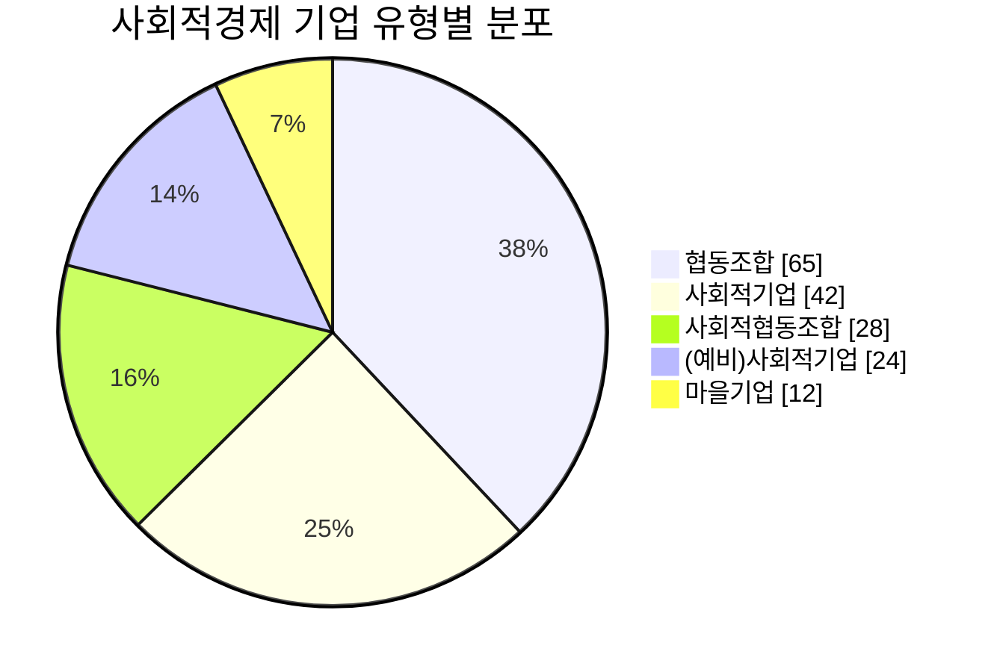

# 👩‍💼 사용자 가이드

이 가이드는 광명시 사회적경제 MCP를 설치하고 사용하는 방법을 안내합니다.
Claude와 대화하듯 자연스럽게 질문하면 됩니다!

---

## 📋 목차

1. [시작하기 전에](#시작하기-전에)
2. [로컬 서버 설치 및 실행](#로컬-서버-설치-및-실행)
3. [Claude Desktop 연결](#claude-desktop-연결)
4. [Claude Code 연결](#claude-code-연결)
5. [기본 사용법](#-기본-사용법)
6. [기업 검색하기](#-기업-검색하기)
7. [통계 생성하기](#-통계-생성하기)
8. [보고서 작성하기](#-보고서-작성하기)
9. [차트 생성하기](#차트-생성하기)
10. [자주 사용하는 명령어 모음](#-자주-사용하는-명령어-모음)
11. [팁과 노하우](#-팁과-노하우)
12. [문제 해결](#문제-해결)

---

## 시작하기 전에

### 필수 프로그램

| 프로그램 | 버전 | 다운로드 | 설명 |
|----------|------|----------|------|
| **Node.js** | 18 이상 | [nodejs.org](https://nodejs.org/) | MCP 서버 실행에 필요 |
| **Claude Desktop** | 최신 | [claude.ai/download](https://claude.ai/download) | AI와 대화하는 앱 |

### 설치 확인

```bash
# Windows: Win+R → cmd 입력 → Enter
# Mac: Spotlight(Cmd+Space) → terminal 입력

node --version
# v18.0.0 이상이면 OK!
```

---

## 로컬 서버 설치 및 실행

MCP 서버는 내 컴퓨터에서 실행됩니다. Claude가 이 서버와 통신하여 데이터를 조회합니다.

### Step 1: 프로젝트 다운로드

#### 방법 A: Git 사용 (권장)

```bash
git clone https://github.com/durume/GM.git
cd GM/gm-social-economy-center/gm-social-economy-mcp
```

#### 방법 B: ZIP 다운로드

1. [GitHub 저장소](https://github.com/durume/GM) 방문
2. 녹색 **Code** 버튼 → **Download ZIP**
3. 압축 해제 후 `gm-social-economy-center/gm-social-economy-mcp` 폴더로 이동

### Step 2: 설치 및 빌드

```bash
# 프로젝트 폴더에서 터미널 열기
# Windows: 폴더에서 Shift+우클릭 → "여기에서 터미널 열기"
# Mac: 폴더를 터미널로 드래그

# 패키지 설치 (처음 한 번만)
npm install

# 빌드 (코드 변경 후마다)
npm run build
```

### Step 3: 서버 테스트

```bash
npm run inspect
```

브라우저가 자동으로 열립니다 (`http://localhost:6274`)

1. **Connect** 버튼 클릭
2. **Tools** 탭 선택
3. `get_statistics` 선택 → `{"statisticsType": "overview"}` 입력 → **Run Tool**
4. 171개 기업 통계가 나오면 성공!

테스트 후 `Ctrl+C`로 종료

---

## Claude Desktop 연결

### 설정 파일 구조 이해하기

Claude Desktop은 **두 개의 설정 파일**을 사용합니다:

| 파일명 | 용도 | 수정 여부 |
|--------|------|----------|
| `config.json` | Claude 일반 설정 (언어, 테마, 스케일 등) | ❌ 수정하지 마세요 |
| `claude_desktop_config.json` | **MCP 서버 설정** | ✅ 이 파일을 생성/편집 |

두 파일은 같은 폴더에 위치하며, 서로 독립적으로 작동합니다.

### Windows 설정

1. `Win+R` 키 → `%APPDATA%\Claude` 입력 → Enter
2. `claude_desktop_config.json` 파일을 **새로 생성** (기존 `config.json`은 그대로 두세요!)
3. 다음 내용 입력:

```json
{
  "mcpServers": {
    "gm-social-economy": {
      "command": "node",
      "args": ["C:\\Users\\사용자이름\\경로\\gm-social-economy-mcp\\dist\\index.js"]
    }
  }
}
```

> **중요**: `C:\\Users\\사용자이름\\경로\\` 부분을 실제 경로로 수정하세요!

4. 저장 후 Claude Desktop 재시작

### macOS 설정

1. Finder에서 `Cmd+Shift+G` → `~/Library/Application Support/Claude` 입력
2. `claude_desktop_config.json` 편집:

```json
{
  "mcpServers": {
    "gm-social-economy": {
      "command": "node",
      "args": ["/Users/사용자이름/경로/gm-social-economy-mcp/dist/index.js"]
    }
  }
}
```

3. 저장 후 Claude Desktop 재시작

### 연결 확인

Claude Desktop에서 물어보세요:
```
광명시 사회적경제 기업 몇 개 등록되어 있어?
```

**"171개"** 라고 답하면 성공!

---

## Claude Code 연결

### CLI 명령어로 추가

```bash
# Windows
claude mcp add gm-social-economy node "C:\Users\사용자이름\경로\dist\index.js"

# macOS/Linux
claude mcp add gm-social-economy node "/Users/사용자이름/경로/dist/index.js"
```

---

---

## 🎯 기본 사용법

### Claude에게 말하듯 질문하세요

MCP는 자연어를 이해합니다. 복잡한 명령어를 외울 필요 없이, 평소에 말하듯 질문하면 됩니다.

**좋은 예시:**
```
✅ "소하동에 있는 사회적기업 목록 좀 보여줘"
✅ "유형별로 기업이 몇 개씩 있는지 알려줘"
✅ "이번 분기 현황 보고서 작성해줘"
```

**피해야 할 예시:**
```
❌ "search_enterprises region=소하동 type=사회적기업"  (너무 기계적)
❌ "검색"  (너무 짧아서 무엇을 원하는지 모름)
```

---

## 🔍 기업 검색하기

### 지역으로 검색

```
"소하동에 있는 기업 찾아줘"
"철산동 소재 기업 목록"
"하안동에 등록된 사회적경제 기업은?"
```

### 유형으로 검색

```
"사회적기업 목록 보여줘"
"협동조합 몇 개 있어?"
"마을기업 찾아줘"
"사회적협동조합 리스트"
```

### 키워드로 검색

```
"카페 운영하는 곳 있어?"
"돌봄 서비스 제공하는 기업 찾아줘"
"교육 관련 사회적기업"
"청소 서비스 업체"
```

### 복합 검색

여러 조건을 함께 사용할 수 있습니다:

```
"소하동에 있는 사회적기업 중에 카페 운영하는 곳"
"철산동 협동조합 목록"
"하안동 마을기업 찾아줘"
```

### 검색 결과 예시

```
## 🔍 검색 결과

**적용된 필터:** 지역: 소하동, 유형: 사회적기업

**검색 결과:** 3개 기업

| # | 기업명 | 유형 | 지역 | 주요 사업 | 연락처 |
|---|--------|------|------|----------|--------|
| 1 | 광명IT사회적기업 | 사회적기업 | 소하동 | IT교육, 디지털 격차... | 02-2680-9876 |
| 2 | ... | ... | ... | ... | ... |
```

---

## 📊 통계 생성하기

### 전체 현황

```
"전체 현황 통계 알려줘"
"사회적경제 기업 현황 요약해줘"
"등록된 기업 수가 몇 개야?"
```

### 유형별 분석

```
"유형별로 몇 개씩 있어?"
"사회적기업이랑 협동조합 중에 뭐가 더 많아?"
"유형별 분포 보여줘"
```

### 지역별 분석

```
"지역별로 기업 수 알려줘"
"어느 동에 기업이 가장 많아?"
"지역별 분포 통계"
```

### 비교 분석

```
"소하동이랑 철산동 기업 수 비교해줘"
"사회적기업과 협동조합 비율 비교"
"하안동 vs 광명동 현황"
```

### 통계 결과 예시

```
# 📊 광명시 사회적경제 기업 현황

> 기준일: 2024-12-20

## 개요

| 구분 | 수치 |
|------|------|
| 전체 기업 수 | **30개** |
| 기업 유형 | 5개 유형 |
| 분포 지역 | 8개 동 |

### 📈 유형별 분포

| 구분 | 기업 수 | 비율 |
|------|--------|------|
| 협동조합 | 8개 | 26.7% |
| 사회적기업 | 7개 | 23.3% |
| ...
```

---

## 📝 보고서 작성하기

### 분기 보고서

공식적인 형식의 분기 보고서를 생성합니다:

```
"이번 분기 현황 보고서 작성해줘"
"2024년 4분기 사회적경제 보고서"
"분기 보고서 만들어줘"
```

### 지역 분석 보고서

특정 지역에 대한 심층 분석 보고서:

```
"소하동 지역 분석 보고서 만들어줘"
"철산동 사회적경제 현황 보고서"
"하안동 기업 분석해줘"
```

### 요약 보고서

한 페이지 분량의 핵심 요약:

```
"시의회 제출용 요약 보고서"
"한 페이지로 정리해줘"
"간단한 현황 요약"
```

### 상세 보고서

전체 기업 목록이 포함된 상세 보고서:

```
"전체 기업 목록 포함한 상세 보고서"
"모든 기업 정보 담은 보고서"
"상세 현황 보고서 작성해줘"
```

### 보고서 예시

```
# 2024년 4분기 광명시 사회적경제 현황 보고서

## 1. 개요

본 보고서는 2024년 4분기 광명시사회적경제센터에 등록된 
사회적경제 기업 현황을 분석하여 보고드립니다.

**작성일:** 2024년 12월 20일
**데이터 기준일:** 2024-12-20
**작성기관:** 광명시사회적경제센터

---

## 2. 전체 현황

| 구분 | 수치 |
|------|------|
| 등록 기업 수 | **30개** |
| 기업 유형 | 5개 유형 |
| 분포 지역 | 8개 행정동 |

...
```

---

## 📌 자주 사용하는 명령어 모음

### 일상 업무용

| 상황 | 명령어 예시 |
|------|------------|
| 민원인이 특정 기업 문의 | "○○기업 연락처 알려줘" |
| 지역 기업 현황 파악 | "소하동 기업 몇 개야?" |
| 특정 서비스 제공 기업 찾기 | "돌봄 서비스 제공하는 곳 찾아줘" |

### 보고서 작성용

| 상황 | 명령어 예시 |
|------|------------|
| 정기 보고서 | "이번 분기 현황 보고서 작성해줘" |
| 시의회 자료 | "시의회 보고용 요약 자료 만들어줘" |
| 지역 분석 | "○○동 기업 분석 보고서" |

### 통계 분석용

| 상황 | 명령어 예시 |
|------|------------|
| 전체 현황 파악 | "전체 통계 알려줘" |
| 유형별 비교 | "사회적기업이랑 협동조합 비교" |
| 지역별 분석 | "지역별 분포 보여줘" |

---

## 💡 팁과 노하우

### 1. 구체적으로 질문하세요

```
❌ "기업 찾아줘"
✅ "소하동에 있는 카페 운영 사회적기업 찾아줘"
```

### 2. 후속 질문을 활용하세요

```
👤: 소하동 기업 목록 보여줘
🤖: (결과 표시)
👤: 이 중에서 사회적기업만 보여줘
🤖: (필터링된 결과 표시)
```

### 3. 보고서는 수정 가능해요

생성된 보고서는 초안입니다. 복사해서 Word에 붙여넣은 후 수정하세요:

```
👤: 분기 보고서 만들어줘
🤖: (보고서 생성)
👤: 향후 계획 부분에 "청년 사회적기업 육성" 추가해줘
🤖: (수정된 보고서)
```

### 4. 데이터 확인하기

```
"데이터 언제 업데이트 됐어?"
"전체 기업 수 알려줘"
"센터 연락처 알려줘"
```

---

## ❓ 도움이 필요할 때

### Claude에게 물어보세요

```
"이 MCP로 뭘 할 수 있어?"
"사용 가능한 기능 알려줘"
"도움말"
```

### 문제가 있을 때

1. Claude Desktop을 재시작해 보세요
2. 같은 질문을 다르게 표현해 보세요
3. 문제가 지속되면 IT 담당자에게 문의하세요

---

---

## 차트 생성하기

MCP는 데이터를 반환하고, Claude가 **Mermaid 차트**로 시각화합니다.

### 파이 차트 (Pie Chart)

```
유형별 분포를 파이 차트로 보여줘
```

Claude가 생성하는 결과:



### 막대 차트 (Bar Chart)

```
지역별 기업 수를 막대 그래프로 보여줘
```

```mermaid
xychart-beta
    title "지역별 기업 분포"
    x-axis [소하동, 철산동, 하안동, 광명동, 일직동]
    y-axis "기업 수" 0 --> 40
    bar [35, 28, 25, 22, 18]
```

### 차트 활용 팁

| 요청 | 차트 유형 |
|------|----------|
| "비율로 보여줘" | 파이 차트 |
| "비교해줘" | 막대 차트 |
| "추이/흐름" | 라인 차트 |
| "구조/관계" | 플로우차트 |

> **참고**: Mermaid 차트는 마크다운을 지원하는 환경에서 렌더링됩니다 (GitHub, Notion, Obsidian 등)

---

## 문제 해결

### 일반적인 문제

| 증상 | 원인 | 해결 방법 |
|------|------|----------|
| "MCP 연결 실패" | 경로 오류 | 설정 파일의 경로 확인 |
| "데이터 파일 없음" | 빌드 안됨 | `npm run build` 실행 |
| "Port in use" | 이전 프로세스 | 프로세스 종료 후 재시작 |
| 검색 결과 0개 | 잘못된 필터 | 지역명/유형명 정확히 입력 |

### 경로 찾기

Windows에서 절대 경로 찾기:
1. 폴더에서 `index.js` 파일 찾기 (`dist` 폴더 안)
2. Shift + 우클릭 → "경로로 복사"
3. 설정 파일에 붙여넣기 (역슬래시 `\`를 `\\`로 변경)

### 로그 확인

Claude Desktop 로그 위치:
- **Windows**: `%APPDATA%\Claude\logs\`
- **macOS**: `~/Library/Logs/Claude/`

---

## 📞 지원

**광명시사회적경제센터**
- 📞 02-2680-6729
- 📧 pjy3869@korea.kr
- 📍 경기도 광명시 오리로 362 광명시사회적경제센터 3층

---

## 다음 단계

- [README.md](../README.md) - 프로젝트 개요
- [DEVELOPER_GUIDE.md](./DEVELOPER_GUIDE.md) - 개발자 가이드 (나만의 MCP 만들기, 클라우드 배포)
